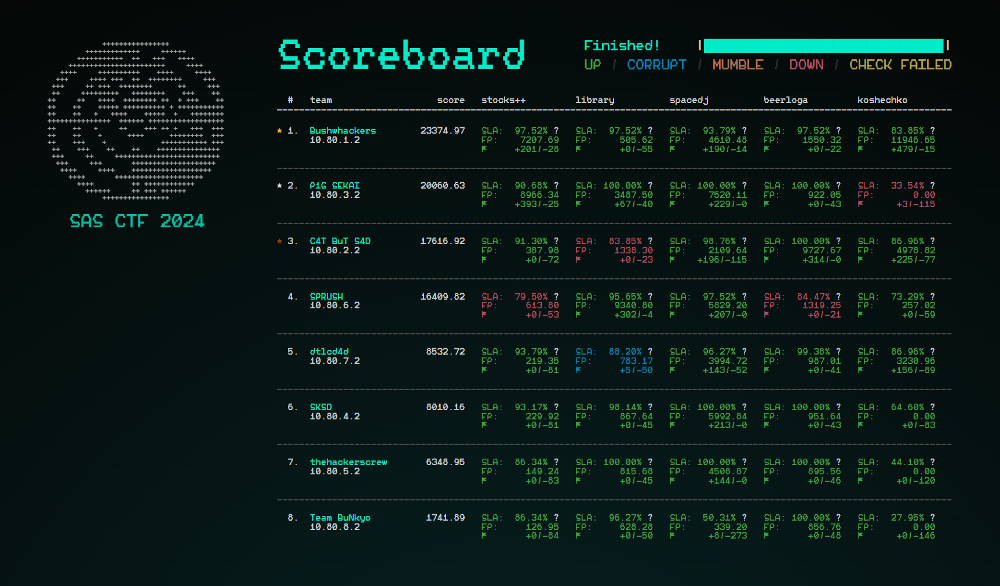

# SAS CTF 2024 Finals

This repository contains services, checkers and writeups from the onsite Attack-Defense finals that took place in Bali, Indonesia on October 22, 2024

https://ctf.thesascon.com/finals \
https://ctftime.org/event/2435

**Duration:** 10 hours

## Partners
- [Kaspersky Academy](https://academy.kaspersky.com/)
- [Yandex.Cloud](https://yandex.cloud/en/)
- [Drovosec](https://drovos.ec)

## Organization team
**Lead:** [@bzvr](https://github.com/bzvr) \
**DevOps:** [@kochanac](https://github.com/kochanac) \
**Frontend:** [@kumfc](https://github.com/kumfc) (PASECA Sans by [@twosd](https://t.me/twosd)) \
**Planet visualization:** [@WeeqnMain](https://github.com/WeeqnMain), [@MaksTresh](https://github.com/MaksTresh)

[ForcAD](https://github.com/pomo-mondreganto/ForcAD/) was used as a checksystem and backend core

## Tasks

| Name | Category | Stack | Authors |
|------|----------|-------|---------|
|[stocks++](pwn-stocks)|pwn|C++, userver|[@m4drat](https://github.com/m4drat)|
|[library](minecraft-library)|minecraft, web|Java, PaperMC, Velocity, Micronaut, Postgres|[@3vilWind](https://github.com/3vilWind), [@MaksTresh](https://github.com/MaksTresh)|
|[spacedj](web-spacedj)|web|Python, Redis, libav (ffmpeg)|[@kumfc](https://github.com/kumfc), [@MaksTresh](https://github.com/MaksTresh), art by [@yeuyes](https://twitter.com/yeuyes)|
|[beerloga](crypto-beerloga)|crypto|Objective-C, Protobuf|[@gkucherin](https://github.com/gkucherin)|
|[koshechko](web-koshechko)|web|Golang, Redis, Postgres|[@kochanac](https://github.com/kochanac), [@mochalkinblues](https://github.com/mochalkinblues)|
