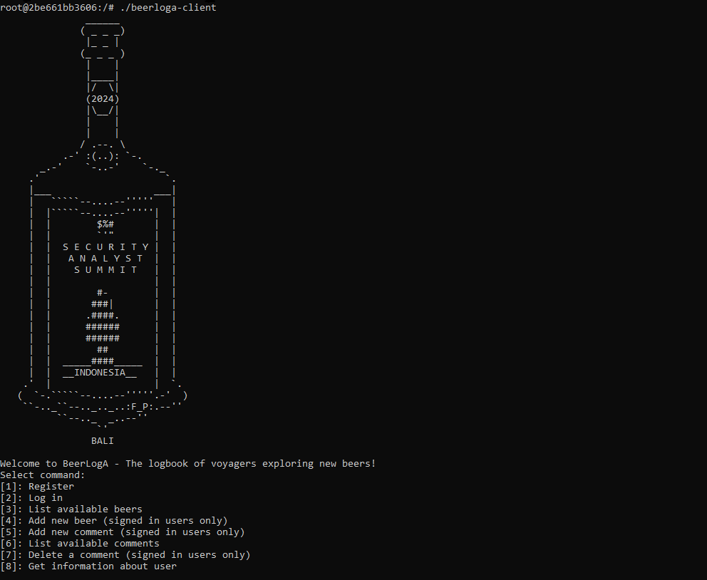

# beerloga

## Description

This service is coded in Objective-C. During the challenge, participants were provided with compiled server and client binaries of the challenge, which were designed to communicate with each other via Protobuf messages. The service itself allows users to exchange opinions on beer. Upon registering, users can add their beer to the database, as well as leave public or private comments on existing beer. The checker inserts flags into the server by creating private comments, and to access them, it is required to know the private key of the comment author.

## Vulnerabilities

All comments are signed with the RDSA algorithm, and it is possible to use a [known lattice-based attack](https://www.di.ens.fr/~fouque/pub/EC03.pdf) on it to recover the private key of each private comment author. 

Check exploit for an example.