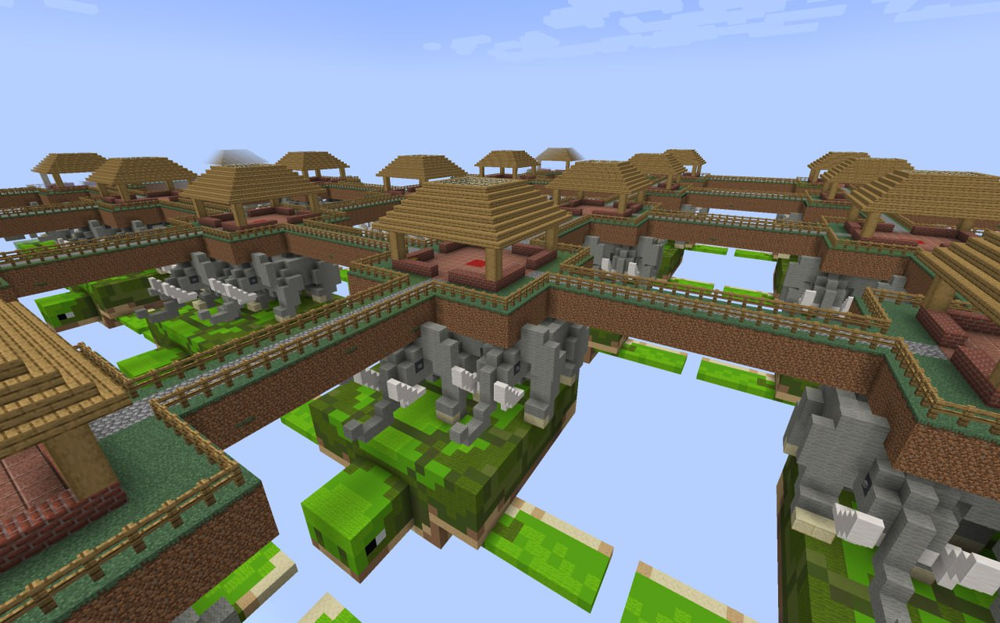

# library



## Description

- 25565 minecraft `velocity` proxy with two servers
    - Proxy allows players to seamlessly switch between servers (using `/server planets` command)
    - It has two plugins installed (ViaBackwards, ViaVersion) to allow players who use different versions to play on the same server
    - Servers
        - LobbyServer `paper (1.21.1)`
            - Vanilla server without any plugins
        - PlanetServer `paper (1.16.5)`
            - Custom `PlanetWorld` plugin is installed
                - Creates you a personal house on an island which is connected with other islands via bridges
                - Creates private region for your house
                - You can use command `/share playername` to share your region with a friend
                - Your friend can use `/travel yourname` command to teleport to your region
                - You can also travel to your region with `/travel`
- 25566 [yggdrasil server](https://wiki.vg/Legacy_Mojang_Authentication) - simple version of a minecraft authorisation server

Flags are stored in the books which can be found inside the chests in checker-owned regions.

## Vulnerabilities
### 1. Warmup

When regions are created in PlanetWorld plugin, we use `region.setFlag(Flags.BUILD, StateFlag.State.DENY);`

This flag disallows you from taking books (which contain flags) from a chest, but still allows you to read the [NBT](https://minecraft.fandom.com/wiki/NBT_format) of items in a chest without taking them out. To do this, you can use custom minecraft clients like Mineflayer or Azalea or modify the official client.

To fix this, change the flags to

```java
region.setFlag(Flags.BLOCK_BREAK, StateFlag.State.DENY);
region.setFlag(Flags.BLOCK_PLACE, StateFlag.State.DENY);
```

### 2. Plugin command injection

You can register an account containing space character. If you try to join the server by IP, you will get an error related to invalid name. But thats only for the lobby server running Paper 1.21.1. Planet server runs Paper 1.16.5 where you still can have spaces in your name. Velocity proxy also allows you to join a certain server directly by its host, in this case by `planets.mc`

Command `/share` internally calls WorldGuard's `rg addmember` in the following way:
```java
String.format("rg addmember %s %s", getPlayerPlanetName(sender.getName()), String.join(" ", args))
```

To exploit that, you want to register 3 accounts: a **Helper**, a **Thief** and an **Attacker**.
- **Helper** username should equal `${randstr()}planet`
- **Attacker** username should equal `${target}planet ${helperName}`, where `helperName` doesn not contain "planet"
- **Thief** username is random

Now you can do the following:
1. Use `/share ${thiefName}` command as an **Attacker**, which will result in `rg addmember ${target}planet ${helperName}planet ${thiefName}`, adding **Helper** and **Thief** to the **Target's** region
2. Use `/travel ${target}` command as a **Thief**
3. You have rights to read the book in the **Target's** region!

### 3. Stealing session by username

Drasl endpoint `/session/minecraft/hasJoined` checks only for the username, allowing you to get the checker's session.

It happens due to the following mechanism:
1) When you login to a minecraft server with online-mode enabled, your client sends a request to your authorisation server (in our case AxelAuth package) to the `/session/minecraft/join` endpoint with accessToken and serverId which is some shared secret obtained through the authorization process.
2) Minecraft server then sends request to the same authorisation server to `/session/minecraft/hasJoined` endpoint with shared serverId and username. Existing implementation doesn't check the relation between username and serverId.

So, you can go to `/session/minecraft/join` with your credentials and then set the ingame username to checker. Server will send a request to `/session/minecraft/hasJoined` with your serverId and checker's username, getting the checker's session for you.

### 4. Region replacement via uppercase letters

Player names are not normalized upon registering, thus you can register account with the same name as checker using a different letter casing. WorldGuard, on the other hand, does normalize the region names, which, in our case, is constructed of `username + "planet"`. As you can see in the implementation fragment below, checker's region will be replaced with your region and you'll have the rights to read the book.

```java
com.sk89q.worldguard.protection.managers.index.HashMapIndex.performAdd
    private void performAdd(ProtectedRegion region) {
    checkNotNull(region);
    region.setDirty(true);
    synchronized (lock) {
        String normalId = normalize(region.getId());
        ProtectedRegion existing = regions.get(normalId);
        // Casing / form of ID has changed
        if (existing != null && !existing.getId().equals(region.getId())) {
            removed.add(existing);
        }
        regions.put(normalId, region);
        removed.remove(region);
        ProtectedRegion parent = region.getParent();
        if (parent != null) {
            performAdd(parent);
        }
    }
}
```