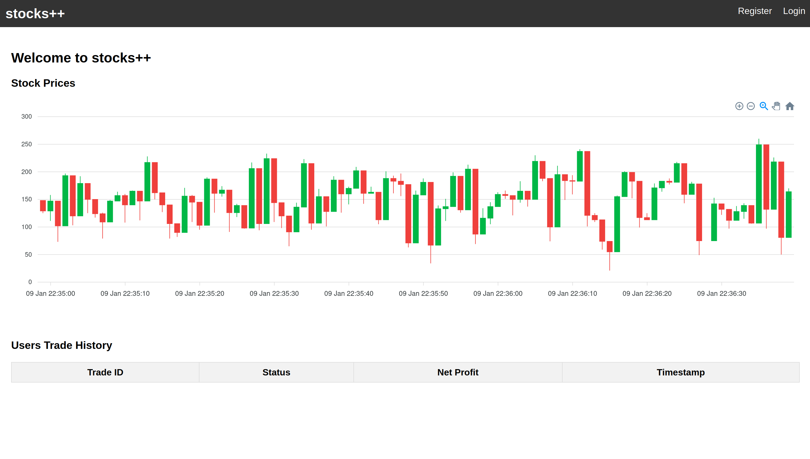

# stocks++



## Description

Welcome to our newest, most innovative trading platform. We are a team of experienced traders and developers who have come together to create a platform that is both easy to use and powerful. Our platform is built on the latest technology and is designed to be fast (extremely fast), secure, and reliable.

You, as a trader can submit trading strategies to our engine. The strategy is basically a mathematical expression that decides whether the strategy buys (positive returns) or sells stock (negative returns). The engine will then run the strategy on the stock market and return the results to you. And that's basically it! You are a millionaire now!

Our strategies can be as simple or as complex as you like. We provide the tools, and you provide the creativity.

In the strategy body you can use the following operators: '+', '-', '*', '/', '(', ')', '!', '^'. In addition we provide some built-in variables that you can use in your strategy. These are:

1. `BALANCE` - Returns the current balance.
2. `STOCK_PRICE` - Returns the current stock price.
3. `HOLDINGS` - Returns the number of stocks the user has.
4. `HOLDINGS_VALUE` - Returns the value of the stocks the user has.

## Using pre-built service binary

Download the [binary](https://storage.yandexcloud.net/sas-1/trusted_trading) and place it at `service/back/trusted_trading`

## Vulnerabilities

**Stack overflow to JIT code overwrite** is the only vulnerability in this service.

The high-level overview of the service is as follows:

The service uses a custom [JIT compiler](https://github.com/m4drat/spark-jit/blob/main/math-evaluator/src/compiler.rs) to evaluate the trading strategies. When the user creates a strategy (basically a mathematical expression), the service converts it to `RPN` and then compiles it to machine code. Finally, the compiled code is executed multiple times with the current stock prices to evaluate the strategy.

Now, the vulnerability lies in the fact that the stack size is not limited when the strategy is evaluated. So by crafting a deeply nested expression, we can overflow the stack and overwrite the JIT code that lies right after the evaluation stack. Something like this does the trick:

```python
(0x4141414141414141 + (0x4141414141414141 + (0x4141414141414141 + ...)))
```

The exploitation scenario goes as follows:

1. Craft a deeply nested expression that overflows the stack. Make sure, however, that the strategy still evaluates to a valid number (e.g. 0).
2. Overwrite the first instruction of JIT code with a `lea rdi, [rip + 0x3f8]` instruction. This basically overwrites the pointer to `EVAL_STACK` with the pointer to `JIT_CODE`.
3. Now, when running the code for the second time, JIT code will write the stack values to the JIT code memory region, effectively giving us arbitrary write primitive, and a shellcode execution right away.

Final exploit can be found [here](./exploit/exploit.py).
